Application Programming Interface is a tool that allows different software applications to communicate with each other. Think of it as a bridge that connects systems, enabling them to share data and perform tasks without knowing the details of how the other system works.

<!--more-->

For example, when you book a flight online, the travel website uses an API to get flight details from the airline’s database.

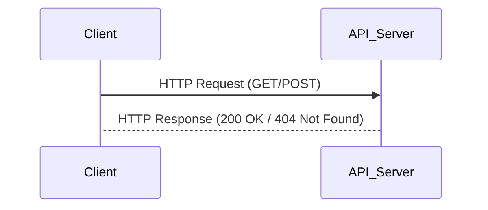

## Types of APIs

### 1. Web APIs

These are the most common and allow communication over the internet using protocols like HTTP. Examples include REST APIs and GraphQL APIs.

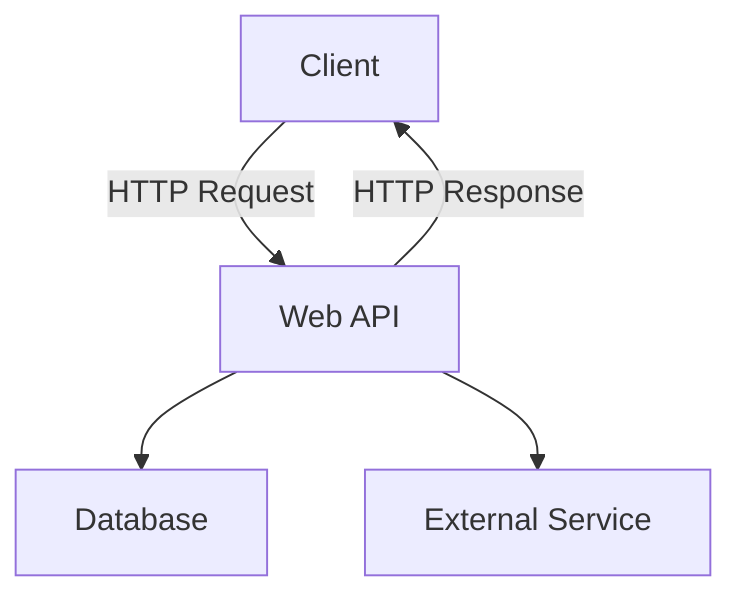

### 2. Library APIs

These let developers use functions from a library (e.g., a math or graphics library) within their application.

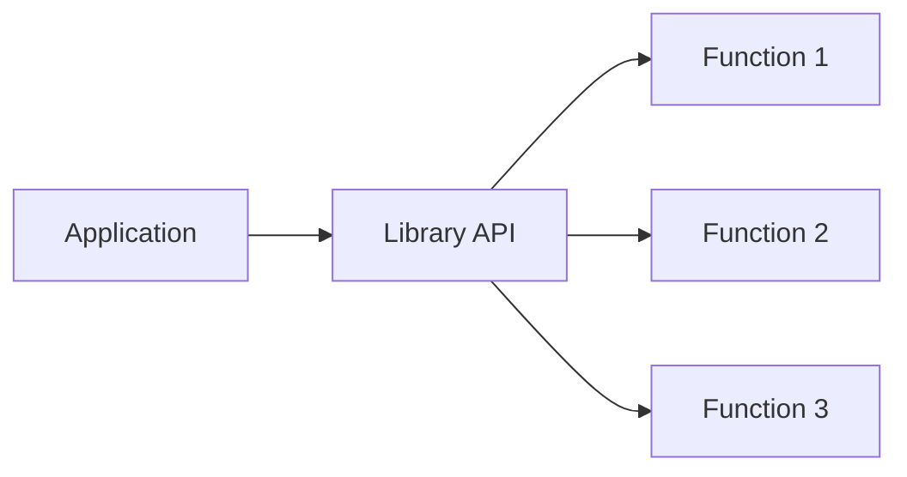

### 3. Operating System APIs

These allow applications to interact with the operating system, like accessing files or managing memory.

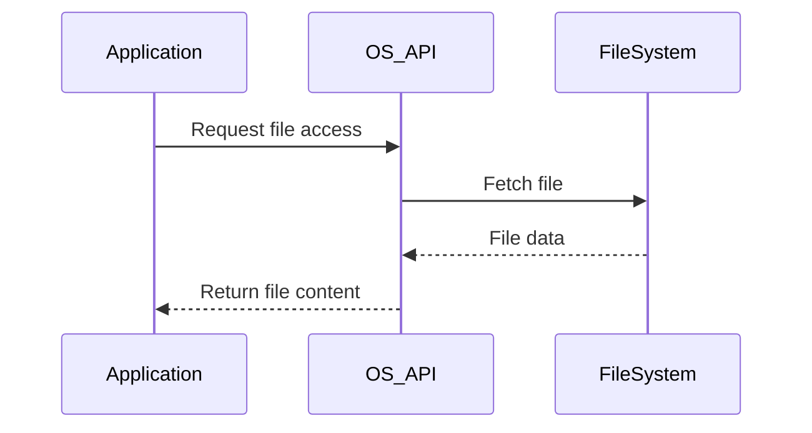

### 4. Database APIs

These allow applications to query and update databases.

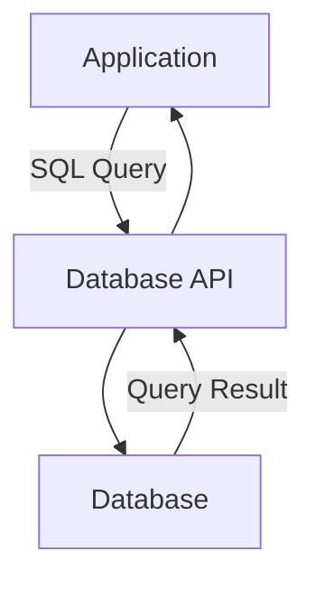

## API Implementations

### 1. REST (Representational State Transfer)

REST APIs are simple, stateless, and work over HTTP. They use methods like GET, POST, PUT, and DELETE for operations.
Example: A weather app fetching data from a weather API using a GET request.

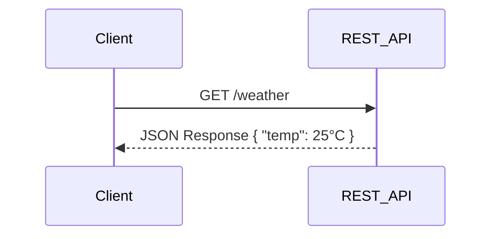

### 2. GraphQL

GraphQL is a query language for APIs that allows clients to request specific data, making it flexible and efficient.
Example: A shopping app requesting only product names and prices from an API.

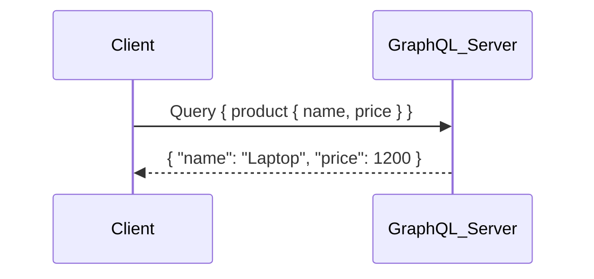

### 3. SOAP (Simple Object Access Protocol)

SOAP APIs use XML and have strict standards, often used in enterprise applications like payment gateways.

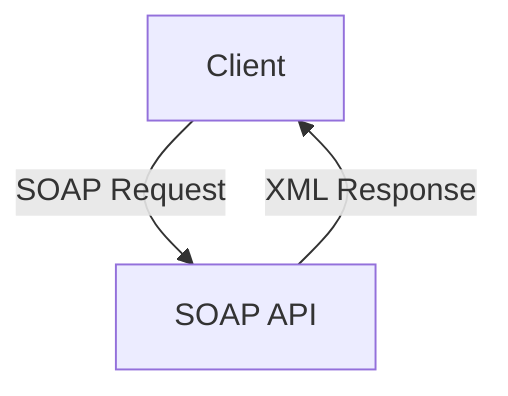

### 4. gRPC

A modern API framework that uses Protocol Buffers for faster communication, often used in microservices.

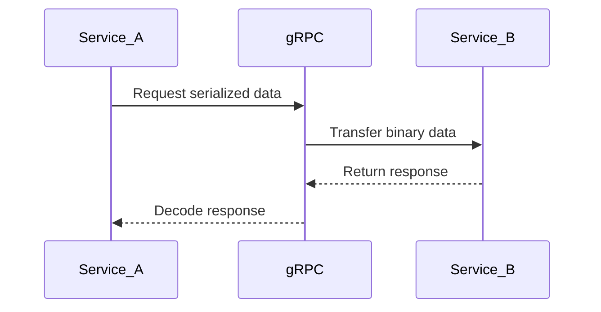

## API Lifecycle

Understanding the **API Lifecycle** helps in managing APIs effectively from inception to retirement.

**Stages:**

- **API Design:** Planning the structure and functionality of the API.
- **Development:** Writing the code and building the API.
- **Testing:** Ensuring the API works as intended and is free of bugs.
- **Deployment:** Making the API available for use.
- **Monitoring:** Tracking the performance and usage of the API.
- **Versioning:** Updating the API to add features or fix issues without disrupting existing users.

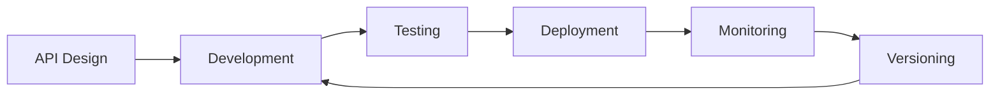

## API Security

APIs are vulnerable to attacks like SQL injection, DDoS, and data breaches. Security measures like authentication, authorization, and encryption are crucial to protect APIs.

**Stages:**

- **Client:** The user or application making the API request.
- **API Gateway:** Manages incoming requests and routes them appropriately.
- **Authentication Service:** Validates the security token provided by the client.
- **API Server:** Processes the request if authentication is successful.
- **Database:** Stores and retrieves data as needed.

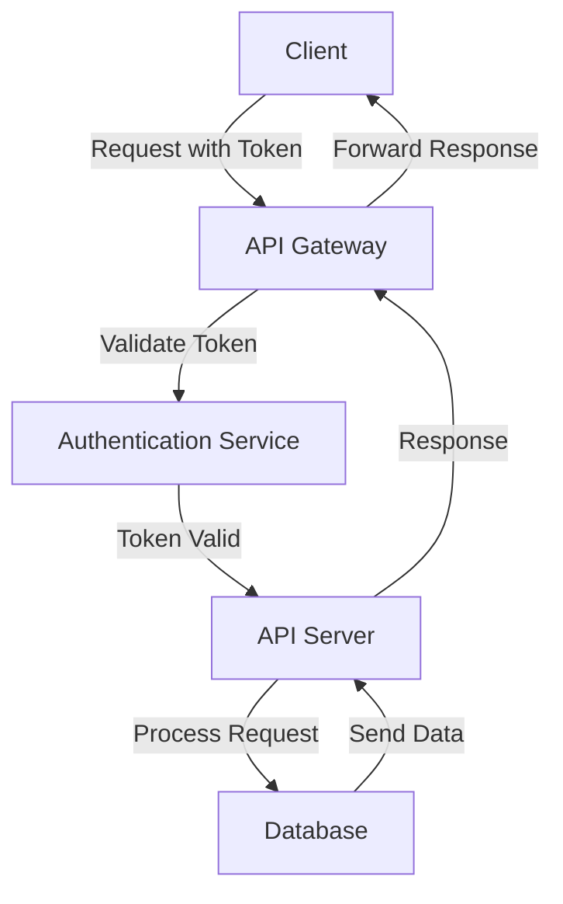

## API Rate Limiting

Rate limiting restricts the number of requests a client can make to an API within a specific time frame, preventing abuse and ensuring fair usage.

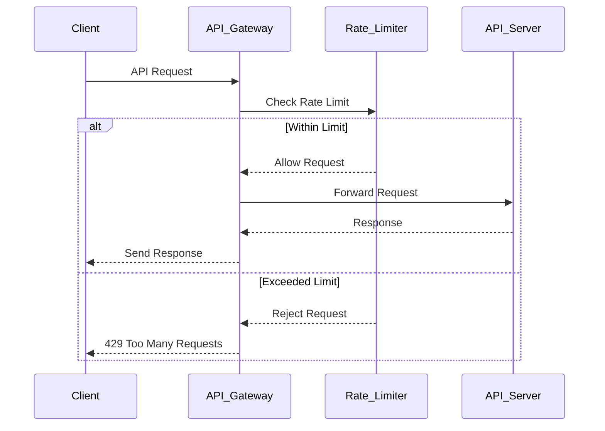

## API Versioning

API versioning is crucial to maintain backward compatibility and allow for changes without breaking existing client applications.

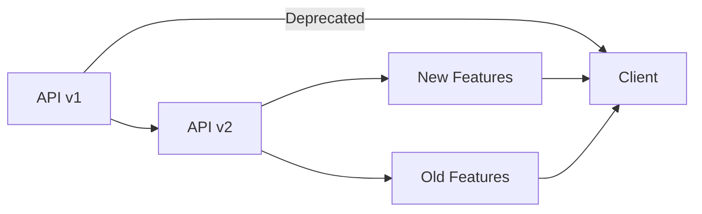

**Explanation:**

- **API v1:** The original version of the API.
- **API v2:** An updated version introducing new features while maintaining old functionalities.
- **Client:** Can continue using the deprecated v1 or migrate to v2.

## API Gateway Architecture

API gateways act as a single entry point for multiple APIs, providing security, monitoring, and routing capabilities.

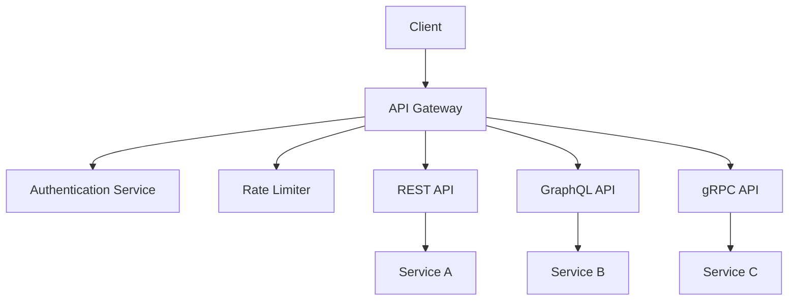

**Explanation:**

- **API Gateway:** Acts as a single entry point for all API requests.
- **Authentication Service:** Handles user authentication.
- **Rate Limiter:** Manages request rates to prevent abuse.
- **REST, GraphQL, gRPC APIs:** Different types of APIs managed by the gateway.
- **Services A, B, C:** Backend services handling specific functionalities.

## Real-World API Integration Example

Demonstrate how multiple APIs work together in a real-world scenario.

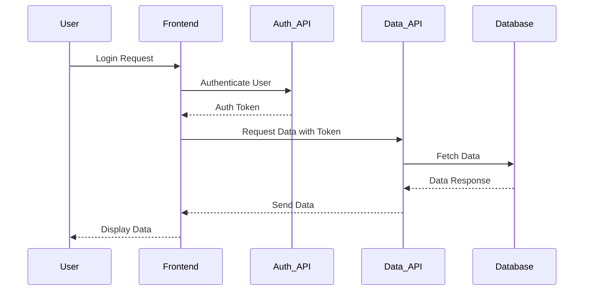

In this flow:

1. The User sends a login request to the Frontend.
2. The Frontend communicates with the Auth_API to authenticate the user.
3. Upon successful authentication, the Auth_API returns an authentication token.
4. The Frontend uses this token to request data from the Data_API.
5. The Data_API fetches the required data from the Database and returns it to the Frontend.
6. Finally, the Frontend displays the data to the User.

## Why APIs Matter

APIs are essential because they:

- Enable software systems to work together seamlessly.
- Simplify complex tasks by hiding implementation details.
- Allow businesses to build integrations and create better user experiences.

APIs power everything from social media integrations to payment systems, making them a cornerstone of modern technology.
